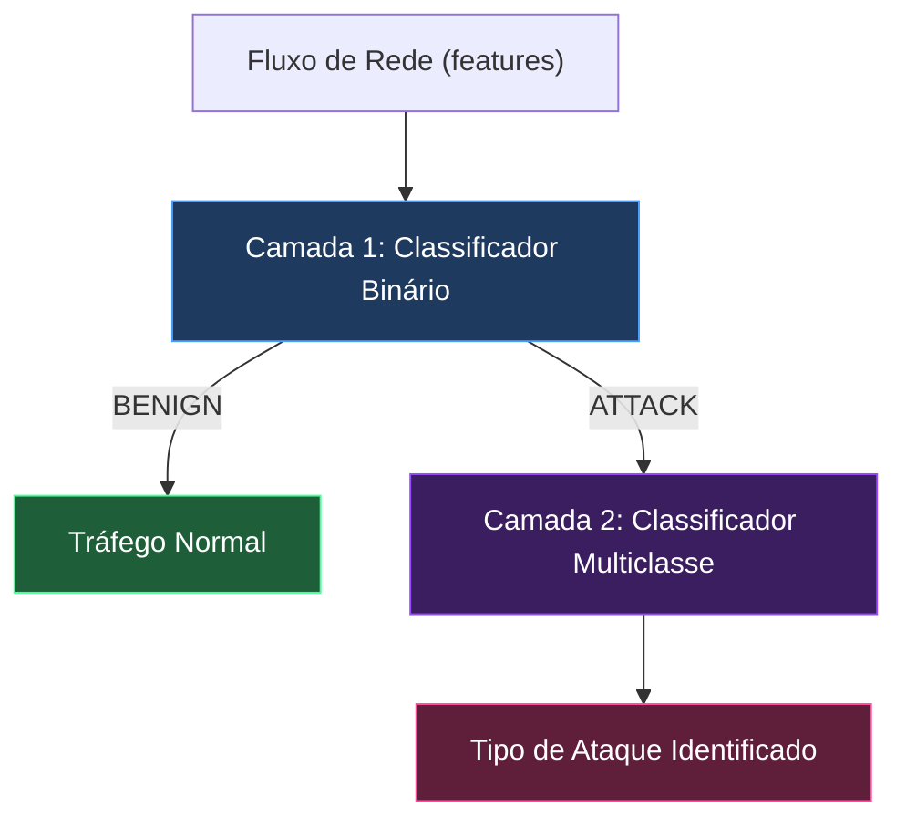
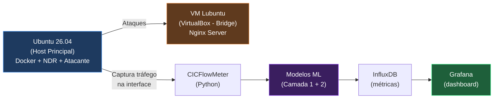

# 🛡️ Real-Time NDR System (Network Detection and Response)


Sistema completo de Detecção e Resposta a Ameaças de Rede (NDR) desenvolvido como Trabalho de Conclusão de Curso (TCC).

## 🧠 Arquitetura de Machine Learning



O sistema foi treinado com o dataset **CICIDS2017** e opera em um pipeline de **Duas Camadas**:
1. **Camada 1 (O Porteiro):** Modelo `XGBoost` otimizado para detecção ultrarrápida binária (`BENIGN` vs `ATTACK`).
2. **Camada 2 (O Especialista):** Modelo `Random Forest` multiclasse responsável por assinar e classificar a ameaça em 12 categorias distintas (DDoS, PortScan, Botnet, Infiltration, etc).

## 🏗️ Fluxo de Funcionamento e Laboratório de Defesa



1. O tráfego de rede é capturado em tempo real (via CICFlowMeter).
2. O script `ndr_live.py` (Watchdog) intercepta as métricas matemáticas do pacote.
3. Se o Porteiro (Camada 1) detectar anomalia, o pacote é enviado ao Especialista (Camada 2).
4. O diagnóstico final (incluindo IP de Origem e Destino) é injetado no banco temporal **InfluxDB**.
5. Um painel interativo no **Grafana** exibe os alertas e as tabelas de ameaças instantaneamente.

## 🛠️ Tecnologias Utilizadas
* **Machine Learning:** Scikit-Learn, LightGBM, XGBoost, Pandas.
* **Infraestrutura:** Docker, Docker Compose.
* **Observabilidade:** InfluxDB, Grafana (Flux Query Language).

## 🚀 Como Subir o Projeto
1. Suba o Banco de Dados e o Painel:
   ```bash
   docker compose up -d
   ```
2. Instale as dependências:
   ```bash
   python3 -m venv venv
   source venv/bin/activate
   pip install -r requirements.txt
   ```
3. Inicie o Motor Vigilante (Watchdog):
   ```bash
   python ndr_live.py
   ```
