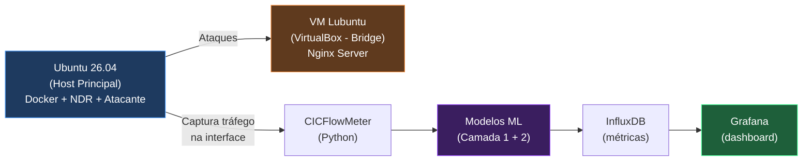
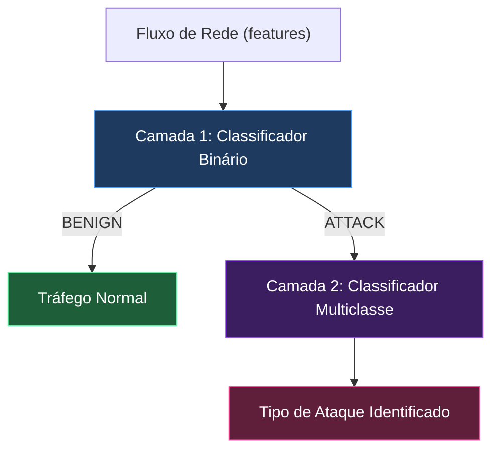
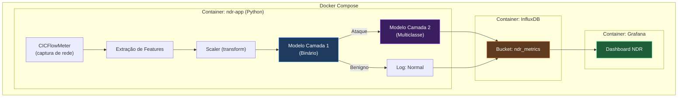

# 🛡️ Plano de Ação — Sistema NDR com ML em Duas Camadas

> **Projeto:** TCC — Identificação e Classificação de Ataques Cibernéticos em Tempo Real  
> **Dataset:** CICIDS 2017 (8 CSVs, ~78 features, ~2.8M registros)  
> **Arquiteto:** Claude (Antigravity)  
> **Data:** 01/06/2026

### Stack do Projeto

| Componente | Ferramenta | Onde |
|---|---|---|
| **Ciência de Dados** | Python + scikit-learn + XGBoost + LightGBM | Google Colab |
| **App NDR em Tempo Real** | Python (captura + inferência) | Local (Docker) |
| **Armazenamento de Métricas** | InfluxDB | Local (Docker) |
| **Dashboard de Monitoramento** | Grafana | Local (Docker) |
| **Containerização** | Docker + Docker Compose | Ubuntu 26.04 |

### Laboratório de Teste



> [!NOTE]
> O atacante roda no host Ubuntu (não em VM Kali) pois ataques entre VMs no mesmo VirtualBox não chegam à VM vítima. A VM Lubuntu com Nginx deve usar rede em **modo Bridge** para estar acessível pelo host.

---

## 📊 Visão Geral do Dataset

| Arquivo | Registros Aprox. | Classes de Ataque |
|---|---|---|
| Monday-WorkingHours | 529.918 | Apenas BENIGN |
| Tuesday-WorkingHours | 445.909 | FTP-Patator (7.938), SSH-Patator (5.897) |
| Wednesday-workingHours | 692.703 | DoS Hulk, GoldenEye, Slowloris, Slowhttptest, Heartbleed |
| Thursday-Morning-WebAttacks | 170.366 | Brute Force, XSS, SQL Injection |
| Thursday-Afternoon-Infilteration | 288.602 | Infiltration (36) |
| Friday-Morning | 191.033 | Bot (1.966) |
| Friday-Afternoon-PortScan | 286.467 | PortScan (158.930) |
| Friday-Afternoon-DDos | 225.745 | DDoS (128.027) |

### Classes e Contagens Totais

| Classe | Contagem | Proporção |
|---|---|---|
| BENIGN | ~2.273.097 | ~80.3% |
| DoS Hulk | 231.073 | ~8.2% |
| PortScan | 158.930 | ~5.6% |
| DDoS | 128.027 | ~4.5% |
| DoS GoldenEye | 10.293 | ~0.36% |
| FTP-Patator | 7.938 | ~0.28% |
| SSH-Patator | 5.897 | ~0.21% |
| DoS slowloris | 5.796 | ~0.20% |
| DoS Slowhttptest | 5.499 | ~0.19% |
| Bot | 1.966 | ~0.07% |
| Web Attack – Brute Force | 1.507 | ~0.05% |
| Web Attack – XSS | 652 | ~0.02% |
| Infiltration | 36 | ~0.001% |
| Heartbleed | 11 | ~0.0004% |
| Web Attack – SQL Injection | 21 | ~0.0007% |

> [!WARNING]
> **Desbalanceamento severo.** Classes como Infiltration (36), Heartbleed (11) e SQL Injection (21) são extremamente raras. Precisaremos de estratégias específicas (agrupamento ou remoção).

---

## 🏗️ Arquitetura do Sistema em Duas Camadas



| | Camada 1 (Binária) | Camada 2 (Multiclasse) |
|---|---|---|
| **Objetivo** | Benigno vs Ataque | Classificar tipo de ataque |
| **Target** | `is_attack` (0/1) | `attack_type` (N classes) |
| **Dados de treino** | Dataset completo | Apenas registros de ataque |
| **Métrica principal** | F1-Score (macro) | F1-Score (macro) |

---

## 📋 FASE 1 — Preparação dos Dados

### 1.1 Carregamento e Concatenação

- Carregar os 8 CSVs com `pd.read_csv()` (atenção ao encoding e espaços nos headers)
- Concatenar em um único DataFrame
- Aplicar `.columns = df.columns.str.strip()` para remover espaços dos nomes de colunas

### 1.2 Limpeza de Dados

| Etapa | Ação |
|---|---|
| **Valores infinitos** | Substituir `np.inf` e `-np.inf` por `np.nan` |
| **Valores faltantes** | Contabilizar NaNs por coluna → remover linhas com NaN (são poucos neste dataset) |
| **Duplicatas** | Verificar e remover duplicatas exatas |
| **Tipos de dados** | Converter todas as features para `float64`; tratar `Flow Bytes/s` e `Flow Packets/s` que podem ter strings |
| **Colunas constantes** | Remover colunas com variância zero (ex: `Bwd PSH Flags`, `Fwd URG Flags`, `Bwd URG Flags`, `CWE Flag Count`) |
| **Colunas duplicadas** | Remover `Fwd Header Length` duplicada (colunas 35 e 56) |

### 1.3 Tratamento de Classes Raras

> [!IMPORTANT]
> **Decisão arquitetural crítica:** Recomendo **remover Infiltration (36), Heartbleed (11) e SQL Injection (21)** do dataset. Com menos de 50 amostras, não é possível treinar um modelo robusto para essas classes. Documente essa decisão no TCC como limitação.

**Alternativa (discutir com orientador):** Agrupar em categorias maiores:
- `DoS/DDoS`: DoS Hulk + GoldenEye + Slowloris + Slowhttptest + DDoS
- `Brute Force`: FTP-Patator + SSH-Patator + Web Attack Brute Force
- `Web Attack`: XSS (+ SQL Injection se mantido)
- `Reconnaissance`: PortScan
- `Botnet`: Bot

### 1.4 Engenharia de Targets

```python
# Camada 1 - Binária
df['is_attack'] = (df['Label'] != 'BENIGN').astype(int)

# Camada 2 - Multiclasse (apenas ataques)
df_attacks = df[df['is_attack'] == 1].copy()
# label encode attack_type
```

### 1.5 EDA (Análise Exploratória)

- Distribuição das classes (bar plot)
- Matriz de correlação das features (heatmap)
- Estatísticas descritivas (`.describe()`)
- Boxplots das features mais relevantes por classe
- Verificar outliers extremos

---

## 📋 FASE 2 — Feature Engineering e Pré-processamento

### 2.1 Remoção de Features por Correlação

- Calcular matriz de correlação de Pearson
- Remover uma de cada par com correlação > 0.95 (mantendo a mais correlacionada com o target)
- Features candidatas a remoção: `Subflow Fwd Packets` ≈ `Total Fwd Packets`, `Subflow Fwd Bytes` ≈ `Total Length of Fwd Packets`, etc.

### 2.2 Split dos Dados (Primeiro Split)

```python
SEED_1 = 42

# Camada 1
X_train_c1, X_test_c1, y_train_c1, y_test_c1 = train_test_split(
    X, y_binary, test_size=0.2, random_state=SEED_1, stratify=y_binary
)

# Camada 2 (apenas ataques)
X_train_c2, X_test_c2, y_train_c2, y_test_c2 = train_test_split(
    X_attacks, y_multiclass, test_size=0.2, random_state=SEED_1, stratify=y_multiclass
)
```

> [!CAUTION]
> **Prevenção de data leakage:** O StandardScaler (ou outro scaler) deve ser fitado APENAS no conjunto de treino e aplicado no teste via `transform()`. Nunca usar `fit_transform()` no dataset completo antes do split.

### 2.3 Normalização / Padronização

- Usar `StandardScaler` (fitado no treino, transformado no treino e no teste)
- Justificativa: Algoritmos como SVM, KNN e Regressão Logística são sensíveis à escala

### 2.4 Balanceamento (Opcional — Discutir com Orientador)

- **Opção A (recomendada):** Não aplicar SMOTE/oversampling; usar `class_weight='balanced'` nos modelos que suportam
- **Opção B:** Aplicar SMOTE apenas no treino (nunca no teste!) via `imblearn.pipeline`
- Justificativa: Para CICIDS 2017, a literatura mostra que modelos baseados em árvore lidam bem com desbalanceamento usando `class_weight`

---

## 📋 FASE 3 — Definição dos 10 Modelos

> [!NOTE]
> Todos os modelos usarão hiperparâmetros **default** nesta fase. A otimização vem depois.

### Modelos Selecionados

| # | Modelo | Classe sklearn/lib | Justificativa |
|---|---|---|---|
| 1 | **Logistic Regression** | `LogisticRegression` | Baseline linear, interpretável |
| 2 | **Decision Tree** | `DecisionTreeClassifier` | Baseline não-linear, interpretável |
| 3 | **Random Forest** | `RandomForestClassifier` | Ensemble de árvores, robusto |
| 4 | **Extra Trees** | `ExtraTreesClassifier` | Variante do RF, mais rápido |
| 5 | **Gradient Boosting** | `GradientBoostingClassifier` | Boosting clássico |
| 6 | **XGBoost** | `XGBClassifier` | Boosting otimizado, estado da arte |
| 7 | **LightGBM** | `LGBMClassifier` | Boosting leve, excelente em grandes datasets |
| 8 | **KNN** | `KNeighborsClassifier` | Baseado em distância, não-paramétrico |
| 9 | **Naive Bayes** | `GaussianNB` | Probabilístico, rápido |
| 10 | **MLP** | `MLPClassifier` | Rede neural, captura padrões complexos |

> [!TIP]
> **Por que esses 10?** Cobrimos 5 famílias de algoritmos: lineares (1), árvores (2-3-4), boosting (5-6-7), baseado em instância (8), probabilístico (9) e redes neurais (10). Isso dá diversidade metodológica excelente para o TCC.

---

## 📋 FASE 4 — Validação Cruzada (CV)

### 4.1 Configuração

```python
N_FOLDS = 5  # ou 10
SEED_CV = 42
cv = StratifiedKFold(n_splits=N_FOLDS, shuffle=True, random_state=SEED_CV)

scoring = {
    'accuracy': 'accuracy',
    'precision_macro': 'precision_macro',
    'recall_macro': 'recall_macro',
    'f1_macro': 'f1_macro'
}
```

### 4.2 Execução

- Para cada modelo, para cada camada:
  - Executar `cross_validate(model, X_train, y_train, cv=cv, scoring=scoring, return_train_score=True)`
  - Armazenar **média** e **desvio padrão** de cada métrica
- Gerar tabela comparativa

### 4.3 Tabelas de Resultado (Exemplo)

**Camada 1 — Binária (CV médias):**

| Modelo | Accuracy | Precision | Recall | F1-Score | Tempo (s) |
|---|---|---|---|---|---|
| Logistic Regression | — | — | — | — | — |
| ... | ... | ... | ... | ... | ... |

*(Mesma estrutura para Camada 2)*

---

## 📋 FASE 5 — Avaliação no Conjunto de Teste

### 5.1 Treino no Conjunto Completo de Treino

- Para cada modelo: `model.fit(X_train, y_train)`
- Predizer no teste: `y_pred = model.predict(X_test)`
- Calcular métricas: accuracy, precision_macro, recall_macro, **f1_macro**

### 5.2 Análise de Generalização (CV vs Teste)

Para cada modelo, calcular:

```
Δf1 = |F1_cv_média - F1_teste|
```

- **Δf1 pequeno** → modelo generaliza bem
- **Δf1 grande** → possível overfitting ou underfitting

### 5.3 Ranking e Seleção Top-2

**Critério primário:** Menor `Δf1` (menor diferença CV-Teste)

| Rank | Modelo | F1_CV | F1_Teste | Δf1 |
|---|---|---|---|---|
| 1 | ? | — | — | — |
| 2 | ? | — | — | — |

> [!IMPORTANT]
> **Análise obrigatória:** Os modelos com melhor F1_CV média são os mesmos com menor Δf1? Discutir no TCC:
> - Se **sim**: o CV é um bom estimador de performance; o modelo generaliza.
> - Se **não**: há possível overfitting nos modelos com melhor CV; modelos mais simples podem generalizar melhor.

**Selecionar Top-2 para cada camada** → Total de **4 modelos** para tuning.

---

## 📋 FASE 6 — Tuning de Hiperparâmetros (RandomizedSearchCV)

### 6.1 Configuração Global

```python
N_ITER = 50          # Mesmo N para todos os modelos
N_FOLDS_TUNE = 5     # Mesmo número de folds
SEED_TUNE = 42       # Mesma semente
scoring = 'f1_macro'  # Métrica de otimização
```

### 6.2 Grids de Hiperparâmetros por Modelo

#### Logistic Regression
```python
{
    'C': [0.001, 0.01, 0.1, 1, 10, 100],
    'penalty': ['l1', 'l2'],
    'solver': ['liblinear', 'saga'],
    'max_iter': [500, 1000, 2000]
}
```

#### Decision Tree
```python
{
    'max_depth': [None, 5, 10, 15, 20, 30, 50],
    'min_samples_split': [2, 5, 10, 20],
    'min_samples_leaf': [1, 2, 4, 8],
    'criterion': ['gini', 'entropy'],
    'max_features': ['sqrt', 'log2', None]
}
```

#### Random Forest
```python
{
    'n_estimators': [50, 100, 200, 300, 500],
    'max_depth': [None, 10, 20, 30, 50],
    'min_samples_split': [2, 5, 10],
    'min_samples_leaf': [1, 2, 4],
    'max_features': ['sqrt', 'log2'],
    'class_weight': ['balanced', 'balanced_subsample', None]
}
```

#### Extra Trees
```python
{
    'n_estimators': [50, 100, 200, 300, 500],
    'max_depth': [None, 10, 20, 30, 50],
    'min_samples_split': [2, 5, 10],
    'min_samples_leaf': [1, 2, 4],
    'max_features': ['sqrt', 'log2'],
    'class_weight': ['balanced', 'balanced_subsample', None]
}
```

#### Gradient Boosting
```python
{
    'n_estimators': [50, 100, 200, 300],
    'learning_rate': [0.01, 0.05, 0.1, 0.2, 0.3],
    'max_depth': [3, 5, 7, 10],
    'min_samples_split': [2, 5, 10],
    'min_samples_leaf': [1, 2, 4],
    'subsample': [0.7, 0.8, 0.9, 1.0]
}
```

#### XGBoost
```python
{
    'n_estimators': [50, 100, 200, 300, 500],
    'learning_rate': [0.01, 0.05, 0.1, 0.2, 0.3],
    'max_depth': [3, 5, 7, 10, 15],
    'min_child_weight': [1, 3, 5, 7],
    'subsample': [0.6, 0.7, 0.8, 0.9, 1.0],
    'colsample_bytree': [0.6, 0.7, 0.8, 0.9, 1.0],
    'gamma': [0, 0.1, 0.2, 0.5]
}
```

#### LightGBM
```python
{
    'n_estimators': [50, 100, 200, 300, 500],
    'learning_rate': [0.01, 0.05, 0.1, 0.2],
    'num_leaves': [15, 31, 50, 80, 127],
    'max_depth': [-1, 10, 20, 30],
    'min_child_samples': [5, 10, 20, 50],
    'subsample': [0.7, 0.8, 0.9, 1.0],
    'colsample_bytree': [0.6, 0.7, 0.8, 0.9, 1.0],
    'class_weight': ['balanced', None]
}
```

#### KNN
```python
{
    'n_neighbors': [3, 5, 7, 9, 11, 15, 21],
    'weights': ['uniform', 'distance'],
    'metric': ['euclidean', 'manhattan', 'minkowski'],
    'p': [1, 2, 3],
    'algorithm': ['ball_tree', 'kd_tree', 'auto']
}
```

#### Naive Bayes (GaussianNB)
```python
{
    'var_smoothing': np.logspace(-12, -2, 50)
}
# Nota: NB tem poucos hiperparâmetros; pode usar GridSearchCV direto
```

#### MLP
```python
{
    'hidden_layer_sizes': [(64,), (128,), (64, 32), (128, 64), (128, 64, 32)],
    'activation': ['relu', 'tanh'],
    'alpha': [0.0001, 0.001, 0.01, 0.1],
    'learning_rate': ['constant', 'adaptive'],
    'learning_rate_init': [0.001, 0.01],
    'max_iter': [300, 500],
    'early_stopping': [True],
    'batch_size': [64, 128, 256]
}
```

### 6.3 Execução

```python
for model_name, (model, param_dist) in selected_models.items():
    search = RandomizedSearchCV(
        estimator=model,
        param_distributions=param_dist,
        n_iter=N_ITER,
        cv=StratifiedKFold(N_FOLDS_TUNE, shuffle=True, random_state=SEED_TUNE),
        scoring='f1_macro',
        random_state=SEED_TUNE,
        n_jobs=-1,
        verbose=1,
        return_train_score=True
    )
    search.fit(X_train, y_train)
    # Salvar best_params_, best_score_, best_estimator_
```

---

## 📋 FASE 7 — Avaliação Final (Novo Split)

### 7.1 Novo Split com Semente Diferente

> [!CAUTION]
> O conjunto de teste da Fase 5 já foi "visto" indiretamente (decisões foram tomadas com base nele). Para avaliação final imparcial, gerar novo split.

```python
SEED_2 = 123  # Semente diferente da Fase 2

X_train_final, X_test_final, y_train_final, y_test_final = train_test_split(
    X, y, test_size=0.2, random_state=SEED_2, stratify=y
)

# Re-fit scaler no novo treino
scaler_final = StandardScaler()
X_train_final = scaler_final.fit_transform(X_train_final)
X_test_final = scaler_final.transform(X_test_final)
```

### 7.2 Treino e Avaliação dos best_models

- Retreinar cada `best_estimator_` no novo `X_train_final`
- Avaliar no novo `X_test_final`
- Gerar: classification_report, confusion_matrix, métricas completas

### 7.3 Seleção do Campeão (1 por camada)

- Selecionar o melhor modelo por camada baseado no **F1-macro no teste final**
- Total: **2 modelos finais** (1 binário + 1 multiclasse)

---

## 📋 FASE 8 — Exportação e Deploy

### 8.1 Exportação dos Modelos (no Colab)

```python
import joblib

# Exportar modelos
joblib.dump(best_model_layer1, 'model_layer1_binary.joblib')
joblib.dump(best_model_layer2, 'model_layer2_multiclass.joblib')

# Exportar scaler (FUNDAMENTAL!)
joblib.dump(scaler_final, 'scaler.joblib')

# Exportar label encoder da camada 2
joblib.dump(label_encoder, 'label_encoder_attacks.joblib')

# Exportar lista de features usadas
joblib.dump(feature_names, 'feature_names.joblib')

# Baixar do Colab e colocar em TCC2/ndr_modelos/
```

### 8.2 Sistema NDR — Docker + InfluxDB + Grafana



**Estrutura do sistema local (Antigravity):**

```
TCC2/
├── docker-compose.yml
├── ndr_app/
│   ├── Dockerfile
│   ├── requirements.txt
│   ├── ndr_live.py          # Script principal de captura + inferência
│   └── config.py            # Configurações (interface, thresholds)
├── ndr_modelos/              # Artefatos exportados do Colab
│   ├── model_layer1_binary.joblib
│   ├── model_layer2_multiclass.joblib
│   ├── scaler.joblib
│   ├── label_encoder_attacks.joblib
│   └── feature_names.joblib
├── grafana/
│   └── provisioning/         # Dashboards e datasources pré-configurados
└── MachineLearningCVE/       # Dataset (não vai para Docker)
```

**Dados gravados no InfluxDB por predição:**
- Timestamp, IP origem, IP destino, porta
- Predição camada 1 (benigno/ataque)
- Predição camada 2 (tipo de ataque, se aplicável)
- Probabilidade/confiança do modelo
- Features principais do fluxo

---

## 📋 FASE 9 — Estrutura de Notebooks (Google Colab)

> [!NOTE]
> Todos os notebooks serão executados no **Google Colab**. Faça upload dos CSVs para o Google Drive e monte com `drive.mount('/content/drive')`. Os artefatos finais (.joblib) devem ser baixados e colocados na pasta `TCC2/ndr_modelos/`.

| Notebook | Conteúdo |
|---|---|
| `01_EDA_e_Limpeza.ipynb` | Fases 1.1 a 1.5 — carregamento, limpeza, EDA |
| `02_Preprocessamento.ipynb` | Fases 2.1 a 2.4 — features, split, scaler, balanceamento |
| `03_CV_Modelos_Default.ipynb` | Fases 3 e 4 — 10 modelos × 2 camadas com CV |
| `04_Avaliacao_Teste.ipynb` | Fase 5 — avaliação no teste, ranking, seleção top-2 |
| `05_Tuning_Hiperparametros.ipynb` | Fase 6 — RandomizedSearchCV nos top-2 × 2 camadas |
| `06_Avaliacao_Final_Export.ipynb` | Fases 7 e 8 — novo split, avaliação final, export |

---

## 📋 Constantes Globais do Projeto

```python
# Sementes
SEED_SPLIT_1 = 42       # Primeiro split (CV + teste)
SEED_SPLIT_2 = 123      # Segundo split (avaliação final)
SEED_CV = 42            # Validação cruzada
SEED_TUNE = 42          # RandomizedSearchCV

# Configurações
N_FOLDS = 5             # Folds do CV
N_FOLDS_TUNE = 5        # Folds do tuning
N_ITER = 50             # Iterações do RandomizedSearchCV
TEST_SIZE = 0.2         # Proporção do teste

# Métricas
PRIMARY_METRIC = 'f1_macro'
```

---

## ✅ Checklist de Execução

- [ ] **Fase 1:** Carregar, limpar e explorar dados
- [ ] **Fase 2:** Feature engineering, split, scaler
- [ ] **Fase 3:** Definir 10 modelos com defaults
- [ ] **Fase 4:** Validação cruzada (5-fold) para ambas as camadas
- [ ] **Fase 5:** Avaliar no teste, calcular Δf1, ranquear top-2
- [ ] **Fase 5b:** Analisar: melhores CV = menores Δf1?
- [ ] **Fase 6:** RandomizedSearchCV (N=50) nos 4 modelos selecionados
- [ ] **Fase 7:** Novo split (seed=123), retreinar e avaliar best_models
- [ ] **Fase 8:** Exportar 2 modelos finais + scaler + encoder
- [ ] **Fase 9:** Integrar no sistema Docker + InfluxDB + Grafana

---

## 🔬 Sugestões Técnicas Adicionais

1. **Feature Importance:** Após treinar os modelos baseados em árvore, extraia e plote as top-20 features mais importantes. Isso enriquece muito a discussão do TCC.

2. **Curvas ROC/AUC:** Para a camada binária, plote a curva ROC de cada modelo. Para multiclasse, use ROC one-vs-rest.

3. **Matriz de Confusão Normalizada:** Use `normalize='true'` no `confusion_matrix` para visualizar as taxas de erro por classe.

4. **Tempo de Inferência:** Meça o tempo de predição de cada modelo — relevante para um sistema NDR em tempo real.

5. **Pipeline sklearn:** Encapsule scaler + modelo em um `sklearn.pipeline.Pipeline` para garantir que não haja data leakage e facilitar o deploy.

6. **Reproducibilidade:** Salve um `requirements.txt` com versões exatas de todas as libs.
